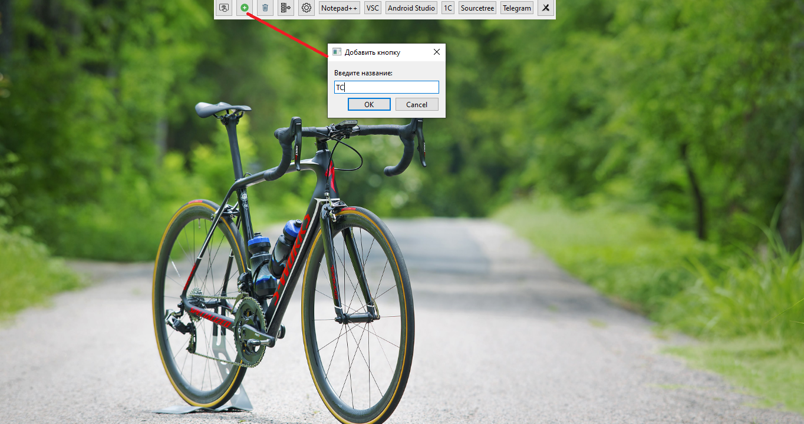
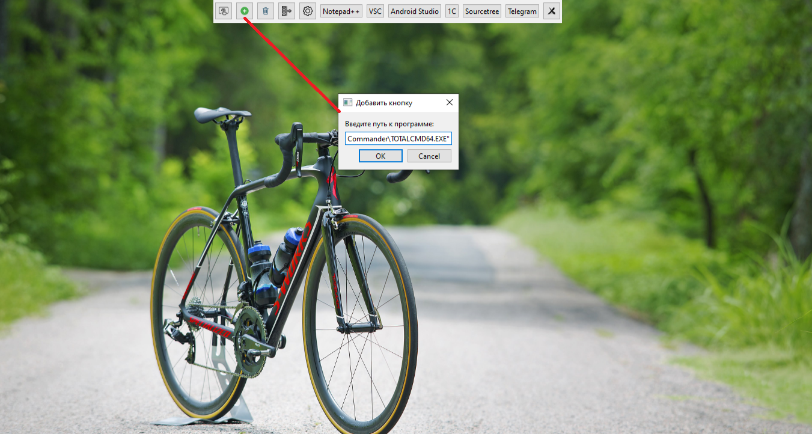
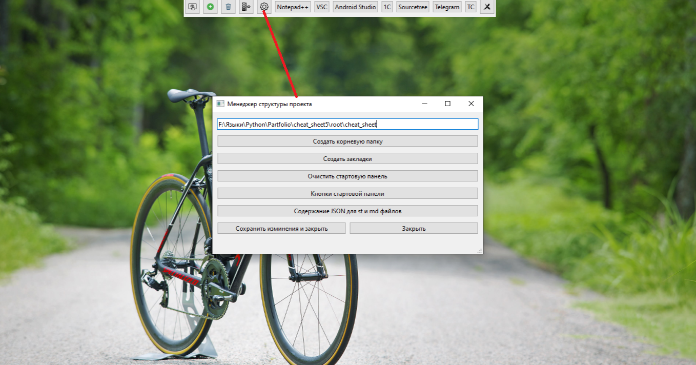

# Разработка кроссплатформенного средства оптимизации ключевой учебной информации для подготовки IT-специалистов на основе фоновой обработки структурированных данных

## **Краткое описание**
### *Что делает проект?*
### Стартовая панель
#### Обзор
*Стартовая панель* - это центральный элемент управления приложением, предоставляющий быстрый доступ к часто используемым файлам и приложениям. Панель сочетает в себе предустановленные системные кнопки и пользовательские кнопки для максимальной гибкости и удобства.

#### ⚡ Основные возможности
#####  Быстрый запуск
Пользователь может создавать собственные кнопки для мгновенного доступа к:
- **Приложениям** (Notepad++, VSCode, Android Studio, Telegram и др.)
- **Файлам** любых форматов
- **Папкам** и директориям
- **Внешним программам** и утилитам

*мини-панель*

##### 🔧 Системные кнопки
Панель включает шесть встроенных кнопок управления:

| Кнопка | Назначение |
|--------|------------|
| ⚙️ **Настройка** | Открывает параметры конфигурации панели |
| 📊 **Боковая панель** | Показывает/скрывает дополнительную панель |
| ➕ **Создать кнопку** | Добавляет новую пользовательскую кнопку |
| 🗑️ **Удалить кнопку** | Удаляет выбранные пользовательские кнопки |
| 📌 **Свернуть панель** | Сворачивает в компактную мини-панель |
| ❌ **Закрыть панель** | Полностью закрывает панель |

##### 🛠️ Создание пользовательских кнопок

###### *Процесс добавления:*
1. Нажмите кнопку **"Создать кнопку"** (➕)
2. Введите **название** кнопки в диалоговом окне
3. Укажите **путь к программе** или файлу
4. Подтвердите создание кнопки

###### Примеры использования:
``` 
Название кнопки: "Notepad++"
Путь к программе: "C:\Program Files\Notepad++\notepad++.exe"

Название кнопки: "Проект Android"
Путь к файлу: "F:\Projects\Android\app\build.gradle"
```
*Создаем кнопку с имени* 


*втарое окно в котором прописываем путь к приложению или файлу*


*результат*


### 📁 Система управления файлами и структурой проекта



#### 🏗️ Архитектура хранения данны
##### *Корневая структура проекта*
Приложение создает организованную систему хранения в корневой папке `cheat_sheet`:

```
cheat_sheet/
├── 📂 for_program/          # Служебные файлы приложения
│   ├── 📄 buttons.json      # Конфигурация кнопок стартовой панели
│   └── 📄 saved_files.json  # Реестр внешних файлов
└── 📂 bookmarks/            # Рабочие файлы пользователя
    ├── 📂 1C/               # Вкладка "1C"
    ├── 📂 Csharp/           # Вкладка "C#"
    ├── 📂 java/             # Вкладка "Java"
    └── 📂 python/           # Вкладка "Python"
```

#### ⚙️ Служебные файлы приложения

##### 🔘 `buttons.json` - Конфигурация кнопок
Файл хранит настройки пользовательских кнопок для быстрого доступа к приложениям и файлам.

**Пример структуры:**
```json
[
    {
        "name": "Notepad++",
        "path": "\"C:\\Program Files\\Notepad++\\notepad++.exe\""
    },
    {
        "name": "VSC",
        "path": "\"E:\\Program Files\\Microsoft VS Code\\Code.exe\""
    },
    {
        "name": "Android Studio",
        "path": "\"C:\\Program Files\\Android\\Android Studio\\bin\\studio64.exe\""
    }
]
```
**Особенности:**
- Автоматическая загрузка при запуске приложения
- Поддержка путей с пробелами (двойные кавычки)
- Совместимость с любыми исполняемыми файлами

##### 📋 `saved_files.json` - Реестр внешних файлов
Отслеживает файлы, расположенные вне корневой папки проекта.

**Пример структуры:**
```json
[
    {
        "path": "F:/Языки/Python/Partfolio/cheat_sheet5/Новый1.st",
        "type": "file",
        "tab_name": "1C"
    },
    {
        "path": "E:/RATILIFE_storage/Шпаргалка по NumPy.md",
        "type": "markdown", 
        "tab_name": "1C"
    }
]
```

**Назначение полей:**
- `path` - полный путь к файлу
- `type` - тип содержимого (`file`, `markdown`)
- `tab_name` - вкладка для отображения в интерфейсе

#### 📚 Рабочая область `bookmarks/`

### Организация по вкладкам
Папка `bookmarks` содержит структурированную коллекцию рабочих файлов:

```
bookmarks/
├── 📂 1C/               # ST-файлы для 1C программирования
│   ├── 1C_shablony.st
│   ├── НовыйШаблон.st
│   └── Образец файла ST.st
├── 📂 Csharp/           # Файлы для C#
├── 📂 java/             # Файлы для Java  
├── 📂 python/           # MD-файлы для Python
└── ... другие языки
```
##### 🔄 Связь с интерфейсом
- **Имя папки = Имя вкладки** в боковой панели
- Каждая папка отображается как отдельная категория в дереве файлов
- Файлы автоматически парсятся и отображаются в соответствующей вкладке

#### 🛠️ Управление через Менеджер структуры проекта

##### Доступные операции:
| Операция                      | Назначение                          |
| ----------------------------- | ----------------------------------- |
| **Создать корневую папку**    | Инициализирует структуру проекта    |
| **Создать закладки**          | Добавляет новые категории/вкладки   |
| **Очистить стартовую панель** | Сбрасывает пользовательские кнопки  |
| **Кнопки стартовой панели**   | Управление конфигурацией кнопок     |
| **Содержание JSON**           | Просмотр структуры служебных файлов |
| **Сохранить изменения**       | Применяет все настройки             |

##### 🔗 Взаимосвязь компонентов
```
Настройки стартовой панели 
    ↓
Создание структуры в bookmarks/
    ↓  
Формирование дерева файлов в боковой панели
    ↓
Организованный доступ к ST/MD файлам через вкладки
```


### **Структура проекта**
```txt
cheat_sheet/ (или cheat_chest)
├── .venv/                    # Виртуальное окружение Python
├── docs/                     # Документация
├── ex/                       # Примеры
├── old/                      # Устаревшие файлы
├── src/ (01.08.2025 15:56)   # Исходный код
│   ├── ANTLR4/               # Система парсинга ANTLR4
│   │   ├── 1c_grammar/       # Грамматика 1С
│   │   ├── ch_grammar/       # Грамматика C#
│   │   ├── java_grammar/     # Грамматика Java
│   │   ├── py_grammar/       # Грамматика Python
│   │   ├── st_grammar/       # Грамматика Structured Text
│   │       ├── __init__.py
│   │       ├── STFile.g4
│   │       ├── STFile.interp
│   │       ├── STFile.tokens
│   │       ├── STFileLexer.interp
│   │       ├── STFileLexer.py
│   │       ├── STFileLexer.tokens
│   │       ├── STFileListener.py
│   │       └── STFileParser.py
│   ├── controllers/          # Контроллеры
│   │   ├── __init__.py
│   │   └── selection_controller.py
│   ├── dialogs/              # Диалоговые окна
│   │   ├── __init__.py
│   │   └── dialog_manager.py
│   ├── editor/               # Система редакторов
│   │   ├── __init__.py
│   │   ├── base_editor.py
│   │   ├── editor_factory.py
│   │   ├── editor_manager.py
│   │   ├── markdown_editor.py
│   │   ├── plain_text_editor.py
│   │   └── st_editor.py
│   ├── global_var/           # Глобальные переменные
│   │   ├── __init__.py
│   │   └── config.py
│   ├── managers/             # Менеджеры приложения
│   │   ├── __init__.py
│   │   ├── dynamic_tabs.py
│   │   ├── file_manager.py
│   │   ├── root_folder_structure_basic.json
│   │   ├── toolbar_manager.py
│   │   ├── tree_model_manager.py
│   │   └── ui_manager.py
│   ├── models/               # Модели данных
│   │   ├── __init__.py
│   │   ├── st_md_file_tree_item.py
│   │   └── st_md_file_tree_model.py
│   ├── observers/            # Наблюдатели
│   │   ├── __init__.py
│   │   ├── file_watcher.py
│   │   └── my_base_observer.py
│   ├── operation/            # Операции
│   │   ├── __init__.py
│   │   └── file_operations.py
│   ├── parsers/              # Парсеры
│   │   ├── __init__.py
│   │   ├── background_parser.py
│   │   ├── content_cache.py
│   │   ├── file_parser_service.py
│   │   ├── md_file_parser.py
│   │   ├── metadata_cache.py
│   │   └── st_file_parser.py
│   ├── start_panel/          # Стартовая панель (MVVM)
│   │   ├── models/
│   │   │   ├── __init__.py
│   │   │   └── model.py
│   │   ├── view_models/
│   │   │   ├── __init__.py
│   │   │   ├── view_model.py
│   │   │   └── view_model_delete_buttons.py
│   │   ├── views/
│   │   │   ├── __init__.py
│   │   │   ├── view.py
│   │   │   └── view_delete_buttons.py
│   │   └── __init__.py
│   ├── ui/                   # Пользовательский интерфейс
│   │   └── files_qt_designer/
│   │       ├── __init__.py
│   │       ├── customization_start_panel.py
│   │       ├── customization_start_panel_window.py
│   │       ├── file_editor.py
│   │       ├── side_panel.py
│   │       ├── start_panel_buttons.py
│   │       └── start_panel_buttons_window.py
│   ├── utils/                # Утилиты
│   │   ├── md/               # Markdown утилиты
│   │   │   ├── __init__.py
│   │   │   ├── markdown_converter.py
│   │   │   ├── markdown_highlighter.py
│   │   │   ├── markdown_styles.py
│   │   │   └── markdown_viewer_widget.py
│   │   ├── st/               # Structured Text утилиты
│   │   │   ├── __init__.py
│   │   │   └── st_highlighter.py
│   │   ├── __init__.py
│   │   └── clipboard_manager.py
│   └── widgets/              # Виджеты
├── tests/                    # Тесты
├── buttons — konwa.json      # Конфигурация кнопок
├── main.py                   # Главный файл приложения
├── method_tracer.py          # Трассировщик методов
├── pytest.ini               # Конфигурация pytest
├── README.MD                # Документация
└── requirements.txt         # Зависимости проекта
```

#### **Основные характеристики проекта:**
    🐍 Python приложение с виртуальным окружением
    🏗️ Модульная архитектура с четким разделением ответственности
    📝 Редактор сниппетов с поддержкой Markdown и Structured Text
    🔍 ANTLR4 для синтаксического анализа различных языков
    🎯 MVVM паттерн в стартовой панели
    ⚡ Кэширование и фоновый парсинг для производительности
    👀 Система наблюдателей для отслеживания изменений
    🎨 Гибкая система UI с Qt


