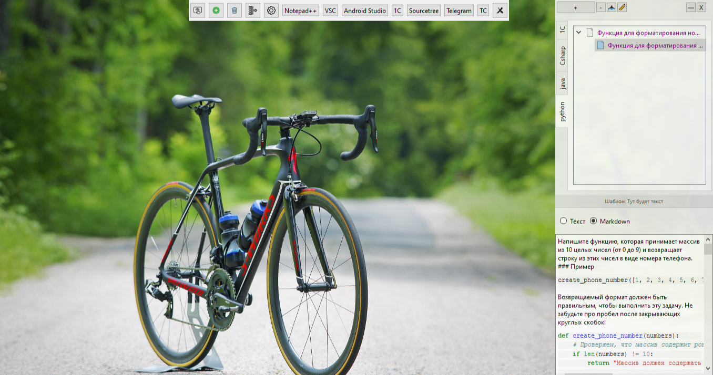
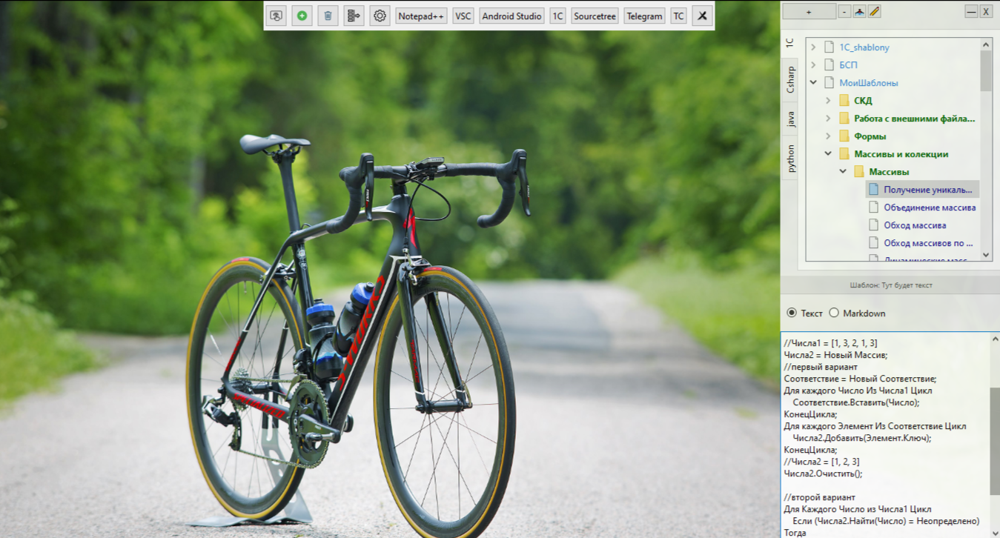
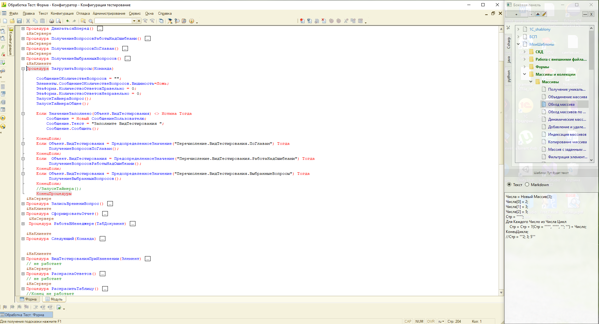
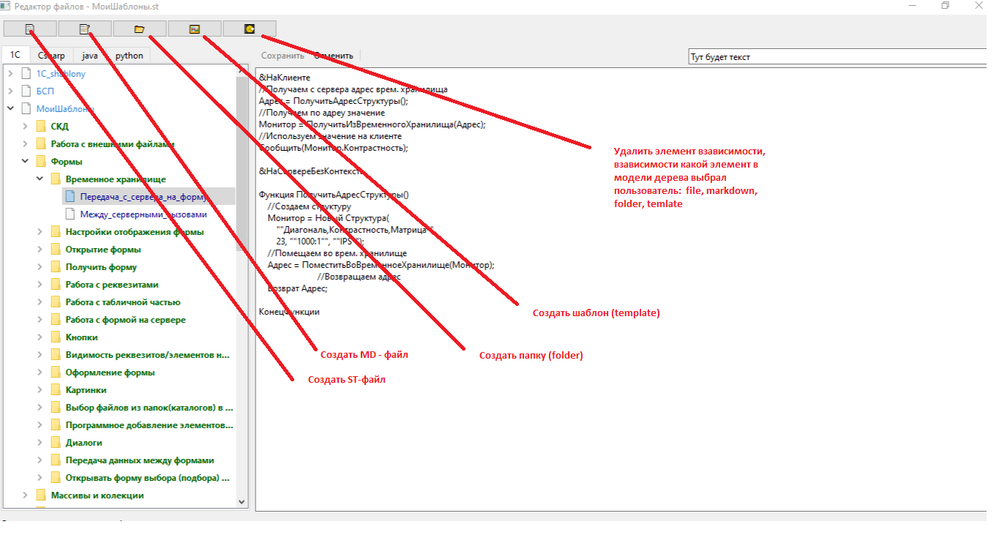

# Разработка кроссплатформенного средства оптимизации ключевой учебной информации для подготовки IT-специалистов на основе фоновой обработки структурированных данных

## **Краткое описание**
### *Что делает проект?*
### Стартовая панель
#### Обзор
*Стартовая панель* - это центральный элемент управления приложением, предоставляющий быстрый доступ к часто используемым файлам и приложениям. Панель сочетает в себе предустановленные системные кнопки и пользовательские кнопки для максимальной гибкости и удобства.

#### ⚡ Основные возможности
#####  Быстрый запуск
Пользователь может создавать собственные кнопки для мгновенного доступа к:
- **Приложениям** (Notepad++, VSCode, Android Studio, Telegram и др.)
- **Файлам** любых форматов
- **Папкам** и директориям
- **Внешним программам** и утилитам

*мини-панель*

##### 🔧 Системные кнопки
Панель включает шесть встроенных кнопок управления:

| Кнопка | Назначение |
|--------|------------|
| ⚙️ **Настройка** | Открывает параметры конфигурации панели |
| 📊 **Боковая панель** | Показывает/скрывает дополнительную панель |
| ➕ **Создать кнопку** | Добавляет новую пользовательскую кнопку |
| 🗑️ **Удалить кнопку** | Удаляет выбранные пользовательские кнопки |
| 📌 **Свернуть панель** | Сворачивает в компактную мини-панель |
| ❌ **Закрыть панель** | Полностью закрывает панель |

##### 🛠️ Создание пользовательских кнопок

###### *Процесс добавления:*
1. Нажмите кнопку **"Создать кнопку"** (➕)
2. Введите **название** кнопки в диалоговом окне
3. Укажите **путь к программе** или файлу
4. Подтвердите создание кнопки

###### Примеры использования:
``` 
Название кнопки: "Notepad++"
Путь к программе: "C:\Program Files\Notepad++\notepad++.exe"

Название кнопки: "Проект Android"
Путь к файлу: "F:\Projects\Android\app\build.gradle"
```
*Создаем кнопку с имени* 


*втарое окно в котором прописываем путь к приложению или файлу*


*результат*


### 📁 Система управления файлами и структурой проекта


#### 🏗️ Архитектура хранения данны
##### *Корневая структура проекта*
Приложение создает организованную систему хранения в корневой папке `cheat_sheet`:

```
cheat_sheet/
├── 📂 for_program/          # Служебные файлы приложения
│   ├── 📄 buttons.json      # Конфигурация кнопок стартовой панели
│   └── 📄 saved_files.json  # Реестр внешних файлов
└── 📂 bookmarks/            # Рабочие файлы пользователя
    ├── 📂 1C/               # Вкладка "1C"
    ├── 📂 Csharp/           # Вкладка "C#"
    ├── 📂 java/             # Вкладка "Java"
    └── 📂 python/           # Вкладка "Python"
```

#### ⚙️ Служебные файлы приложения

##### 🔘 `buttons.json` - Конфигурация кнопок
Файл хранит настройки пользовательских кнопок для быстрого доступа к приложениям и файлам.

**Пример структуры:**
```json
[
    {
        "name": "Notepad++",
        "path": "\"C:\\Program Files\\Notepad++\\notepad++.exe\""
    },
    {
        "name": "VSC",
        "path": "\"E:\\Program Files\\Microsoft VS Code\\Code.exe\""
    },
    {
        "name": "Android Studio",
        "path": "\"C:\\Program Files\\Android\\Android Studio\\bin\\studio64.exe\""
    }
]
```
**Особенности:**
- Автоматическая загрузка при запуске приложения
- Поддержка путей с пробелами (двойные кавычки)
- Совместимость с любыми исполняемыми файлами

##### 📋 `saved_files.json` - Реестр внешних файлов
Отслеживает файлы, расположенные вне корневой папки проекта.

**Пример структуры:**
```json
[
    {
        "path": "F:/Языки/Python/Partfolio/cheat_sheet5/Новый1.st",
        "type": "file",
        "tab_name": "1C"
    },
    {
        "path": "E:/RATILIFE_storage/Шпаргалка по NumPy.md",
        "type": "markdown", 
        "tab_name": "1C"
    }
]
```

**Назначение полей:**
- `path` - полный путь к файлу
- `type` - тип содержимого (`file`, `markdown`)
- `tab_name` - вкладка для отображения в интерфейсе

#### 📚 Рабочая область `bookmarks/`

### Организация по вкладкам
Папка `bookmarks` содержит структурированную коллекцию рабочих файлов:

```
bookmarks/
├── 📂 1C/               # ST-файлы для 1C программирования
│   ├── 1C_shablony.st
│   ├── НовыйШаблон.st
│   └── Образец файла ST.st
├── 📂 Csharp/           # Файлы для C#
├── 📂 java/             # Файлы для Java  
├── 📂 python/           # MD-файлы для Python
└── ... другие языки
```
##### 🔄 Связь с интерфейсом
- **Имя папки = Имя вкладки** в боковой панели
- Каждая папка отображается как отдельная категория в дереве файлов
- Файлы автоматически парсятся и отображаются в соответствующей вкладке

#### 🛠️ Управление через Менеджер структуры проекта

##### Доступные операции:
| Операция                      | Назначение                          |
| ----------------------------- | ----------------------------------- |
| **Создать корневую папку**    | Инициализирует структуру проекта    |
| **Создать закладки**          | Добавляет новые категории/вкладки   |
| **Очистить стартовую панель** | Сбрасывает пользовательские кнопки  |
| **Кнопки стартовой панели**   | Управление конфигурацией кнопок     |
| **Содержание JSON**           | Просмотр структуры служебных файлов |
| **Сохранить изменения**       | Применяет все настройки             |

##### 🔗 Взаимосвязь компонентов
```
Настройки стартовой панели 
    ↓
Создание структуры в bookmarks/
    ↓  
Формирование дерева файлов в боковой панели
    ↓
Организованный доступ к ST/MD файлам через вкладки
```

### 📊 Боковая панель - Основной рабочий интерфейс

Боковая панель является центральным элементом приложения, обеспечивающим эффективную работу с библиотекой сниппетов кода. Панель разделена на две функциональные части:







##### Верхняя часть: **Дерево файлов**
- Иерархическое представление всех тем и примеров кода
- Группировка по языкам программирования и категориям
- Быстрая навигация по структурированному контенту

##### Нижняя часть: **Панель просмотра**
- Отображение содержимого выбранных элементов
- Поддержка синтаксической подсветки
- Интерактивное взаимодействие с кодом

#### 📄 Поддерживаемые форматы файлов

##### 🔷 **ST-файлы (Structured Text)**
**Для структурированных фрагментов кода**

```text
{1,
{5,
{"Новый5",1,0,"",""},
{0,
{"Текст",0,0,"","		
        Сообщение = Новый СообщениеПользователю;
		Сообщение.Текст = """";
		Сообщение.Поле = """";
		Сообщение.УстановитьДанные();
		Сообщение.Сообщить();		"}
},
{3,
{"Папка",1,0,"",""},
{0,
{"Текст2",0,0,"","Привет"}
},
{0,
{"текст3",0,0,"","содержимое"}
},
{2,
{"Вложенная папка",1,0,"",""},
{0,
{"Текст",0,0,""," содержимое"}
},
{2,
{"Еще папка",1,0,"",""},
{0,
{"текст6",0,0,"",""}
},
{0,
{"текст7",0,0,"",""}
}
}
}
},
{1,
{"Папка2",1,0,"",""},
{0,
{"Текст4",0,0,"","ПравоДоступа(""Чтение"", ""<ОбъектМетаданных>"", ""<Пользователь/Роль>"", ""<СтандартныйРеквизитСтандартнаяТабличнаяЧасть>"")"}
}
},
{0,
{"текст5 ",0,0,"","текст шаблона 
еще текст шаблона"}
},
{1,
{"Папка3",1,0,"",""},
{0,
{"текст",0,0,"",""}
}
}
}
}
```
**Структура ST-файлов:**
- ` Заголовок` - корневой раздел
- ` Тема` - категория примеров
- ` Шаблон:` - конкретный фрагмент кода
- Поддержка иерархического вложения тем

##### 🔶 **MD-файлы (Markdown)**
**Для расширенной документации и примеров**

```markdown
# Название библиотеки

## Описание функций
- **Функция 1** - краткое описание
- **Функция 2** - краткое описание

---

### Пример использования:
```python
def create_phone_number(numbers):
    # Проверяем, что массив содержит 10 чисел
    if len(numbers) != 10:
        return "Массив должен содержать 10 чисел"
    return "({}{}{}) {}{}{}-{}{}{}{}".format(*numbers)
```

**Тестовый случай:**
- Вход: [1, 2, 3, 4, 5, 6, 7, 8, 9, 0]
- Выход: "(123) 456-7890"

##### 🌳 Модель дерева файлов

**Пример структуры из скриншотов:**
```
📁 1C/
├── 📄 Сайнер.st
│   ├── 📁 Рубьев
│   │   ├── Джа
│   │   └── Самар
│   └── 📁 Тормойнору
│       ├── ВСП
│       │   └── МомШаблоны
│       ├── СКД
│       │   └── Работа с внешними файлами...
│       └── Формы
├── 📄 Шпаргалка по массивам.st
│   └── 📁 Массивы
│       ├── Получение уникальных значений
│       ├── Объединение массивов
│       └── Обход массива по условию
└── 📄 NumPy библиотека.md
    ├── Основы работы с матрицами
    └── Специальные функции
```

##### 💡 Преимущества двойной системы файлов

###### **ST-файлы** идеально подходят для:
- Быстрых фрагментов кода
- Структурированных шаблонов
- Иерархической организации тем
- Лаконичного представления информации

###### **MD-файлы** оптимальны для:
- Подробных объяснений и документации
- Примеров с расширенными комментариями
- Синтаксиса нескольких языков в одном файле
- Форматированного текста с таблицами и списками

##### 🔄 Рабочий процесс

1. **Навигация** → Выбор темы в дереве файлов (верхняя панель)
2. **Просмотр** → Изучение содержимого в панели просмотра (нижняя панель)
3. **Поиск** → Быстрый доступ через структурированную организацию
4. **Использование** → Копирование фрагментов кода в рабочие проекты

### ✏️ Редактор файлов - Создание и редактирование контента
Редактор файлов предоставляет комплексный инструмент для управления структурой и содержимым вашей библиотеки кода. Интерфейс разделен на три функциональные зоны:



#### 1. 🛠️ **Панель управления** (верхняя часть)
- **Создать ST-файл** - новый файл структурированного текста
- **Создать MD-файл** - новый Markdown-файл
- **Создать папку (folder)** - тематический раздел
- **Создать шаблон (template)** - отдельный фрагмент кода
- **Удалить элемент** - удаление выбранных элементов модели

####  2. 🌳 **Модель дерева файлов** (левая часть)
Иерархическое представление структуры с поддержкой элементов:
- **📁 Folder** - тематические разделы и заголовки
- **📄 File** - ST и MD файлы
- **📝 Template** - отдельные фрагменты кода
- **📋 Markdown** - документы расширенного формата

#### 3. 📝 **Редактор содержимого** (правая часть)
Панель для внесения и редактирования информации с поддержкой:
- Синтаксической подсветки
- Иерархического форматирования
- Предпросмотра Markdown

#### *Типы создаваемых элементов*
📋 **MD-файл (Markdown)**
📄 **ST-файл (Structured Text)**
🗂️ **Папка (Folder)**
📝 **Шаблон (Template)**

### *Какую проблему решает?*

#### Основная проблема: **Неэффективная организация и доступ к учебным материалам и шаблонам кода для IT-специалистов**

##### **Конкретные аспекты проблемы:**
##### 📚 *Проблема фрагментированных знаний*
- Учебные материалы, фрагменты кода и документация разбросаны по разным файлам и папкам
- Отсутствие единой структурированной системы хранения информации
- Сложность быстрого поиска нужных примеров кода среди множества файлов

##### ⏱️ *Проблема временных затрат*
- Длительный поиск часто используемых готовых фрагментов и шаблонов кода
- Необходимость каждый раз вспоминать синтаксис стандартных решений
- Потеря времени на навигацию между разными приложениями и файлами

##### 🔄 *Проблема стандартизации*
- Отсутствие единого формата для хранения примеров кода
- Разные стили документации у разных разработчиков
- Сложность обмена знаниями в команде из-за неструктурированных данных

##### 🛠️ *Проблема инструментария*
- Необходимость использовать несколько программ одновременно (редакторы, файловые менеджеры, IDE)
- Отсутствие специализированного инструмента для работы со сниппетами
- Сложность поддержания актуальности учебных материалов

#### **Как приложение решает эти проблемы:** 

##### ✅ *Централизация знаний*
- Единое хранилище для всех фрагментов кода и учебных материалов
- Структурированная организация по языкам и темам
- Быстрый доступ через интуитивный интерфейс

##### ✅ *Оптимизация рабочего процесса*
- Стартовая панель для мгновенного запуска часто используемых инструментов
- Боковая панель с иерархическим представлением знаний
- Интегрированный редактор для создания и редактирования материалов

##### ✅ *Стандартизация форматов*
- Унифицированные форматы ST и MD файлов
- Единая структура хранения информации


##### ✅ *Автоматизация рутинных задач*
- Фоновый парсинг и кэширование для производительности
- Автоматическое обновление интерфейса при изменениях
- Интеграция с внешними файлами и приложениями

### *Для кого предназначен?*
#### *IT-студенты и начинающие разработчики*
Потребность: Структурированное хранение учебных материалов
Выгода: Быстрый доступ к примерам кода, шаблонам, конспектам
Использование: Создание личной базы знаний по изучаемым языкам программирования

### **Технологии**
**ANTLR4** - генератор парсеров для синтаксического анализа ST/MD файлов
**PySide6** - фреймворк для создания кроссплатформенного GUI на Qt6
**Pygments** - библиотека подсветки синтаксиса в редакторе кода
**Pytest** - фреймворк для модульного тестирования приложения
**Coverage** - инструмент анализа покрытия кода тестами
**Colorama** - кроссплатформенная цветная output-печать в консоли


### **Структура проекта**
```txt
cheat_sheet/ (или cheat_chest)
├── .venv/                    # Виртуальное окружение Python
├── docs/                     # Документация
├── ex/                       # Примеры
├── old/                      # Устаревшие файлы
├── src/ (01.08.2025 15:56)   # Исходный код
│   ├── ANTLR4/               # Система парсинга ANTLR4
│   │   ├── 1c_grammar/       # Грамматика 1С
│   │   ├── ch_grammar/       # Грамматика C#
│   │   ├── java_grammar/     # Грамматика Java
│   │   ├── py_grammar/       # Грамматика Python
│   │   ├── st_grammar/       # Грамматика Structured Text
│   │       ├── __init__.py
│   │       ├── STFile.g4
│   │       ├── STFile.interp
│   │       ├── STFile.tokens
│   │       ├── STFileLexer.interp
│   │       ├── STFileLexer.py
│   │       ├── STFileLexer.tokens
│   │       ├── STFileListener.py
│   │       └── STFileParser.py
│   ├── controllers/          # Контроллеры
│   │   ├── __init__.py
│   │   └── selection_controller.py
│   ├── dialogs/              # Диалоговые окна
│   │   ├── __init__.py
│   │   └── dialog_manager.py
│   ├── editor/               # Система редакторов
│   │   ├── __init__.py
│   │   ├── base_editor.py
│   │   ├── editor_factory.py
│   │   ├── editor_manager.py
│   │   ├── markdown_editor.py
│   │   ├── plain_text_editor.py
│   │   └── st_editor.py
│   ├── global_var/           # Глобальные переменные
│   │   ├── __init__.py
│   │   └── config.py
│   ├── managers/             # Менеджеры приложения
│   │   ├── __init__.py
│   │   ├── dynamic_tabs.py
│   │   ├── file_manager.py
│   │   ├── root_folder_structure_basic.json
│   │   ├── toolbar_manager.py
│   │   ├── tree_model_manager.py
│   │   └── ui_manager.py
│   ├── models/               # Модели данных
│   │   ├── __init__.py
│   │   ├── st_md_file_tree_item.py
│   │   └── st_md_file_tree_model.py
│   ├── observers/            # Наблюдатели
│   │   ├── __init__.py
│   │   ├── file_watcher.py
│   │   └── my_base_observer.py
│   ├── operation/            # Операции
│   │   ├── __init__.py
│   │   └── file_operations.py
│   ├── parsers/              # Парсеры
│   │   ├── __init__.py
│   │   ├── background_parser.py
│   │   ├── content_cache.py
│   │   ├── file_parser_service.py
│   │   ├── md_file_parser.py
│   │   ├── metadata_cache.py
│   │   └── st_file_parser.py
│   ├── start_panel/          # Стартовая панель (MVVM)
│   │   ├── models/
│   │   │   ├── __init__.py
│   │   │   └── model.py
│   │   ├── view_models/
│   │   │   ├── __init__.py
│   │   │   ├── view_model.py
│   │   │   └── view_model_delete_buttons.py
│   │   ├── views/
│   │   │   ├── __init__.py
│   │   │   ├── view.py
│   │   │   └── view_delete_buttons.py
│   │   └── __init__.py
│   ├── ui/                   # Пользовательский интерфейс
│   │   └── files_qt_designer/
│   │       ├── __init__.py
│   │       ├── customization_start_panel.py
│   │       ├── customization_start_panel_window.py
│   │       ├── file_editor.py
│   │       ├── side_panel.py
│   │       ├── start_panel_buttons.py
│   │       └── start_panel_buttons_window.py
│   ├── utils/                # Утилиты
│   │   ├── md/               # Markdown утилиты
│   │   │   ├── __init__.py
│   │   │   ├── markdown_converter.py
│   │   │   ├── markdown_highlighter.py
│   │   │   ├── markdown_styles.py
│   │   │   └── markdown_viewer_widget.py
│   │   ├── st/               # Structured Text утилиты
│   │   │   ├── __init__.py
│   │   │   └── st_highlighter.py
│   │   ├── __init__.py
│   │   └── clipboard_manager.py
│   └── widgets/              # Виджеты
├── tests/                    # Тесты
├── buttons — konwa.json      # Конфигурация кнопок
├── main.py                   # Главный файл приложения
├── method_tracer.py          # Трассировщик методов
├── pytest.ini               # Конфигурация pytest
├── README.MD                # Документация
└── requirements.txt         # Зависимости проекта
```

#### **Основные характеристики проекта:**
    🐍 Python приложение с виртуальным окружением
    🏗️ Модульная архитектура с четким разделением ответственности
    📝 Редактор сниппетов с поддержкой Markdown и Structured Text
    🔍 ANTLR4 для синтаксического анализа различных языков
    🎯 MVVM паттерн в стартовой панели
    ⚡ Кэширование и фоновый парсинг для производительности
    👀 Система наблюдателей для отслеживания изменений
    🎨 Гибкая система UI с Qt


