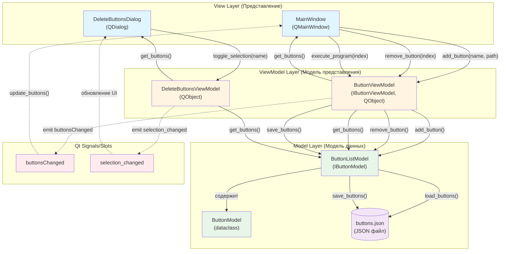
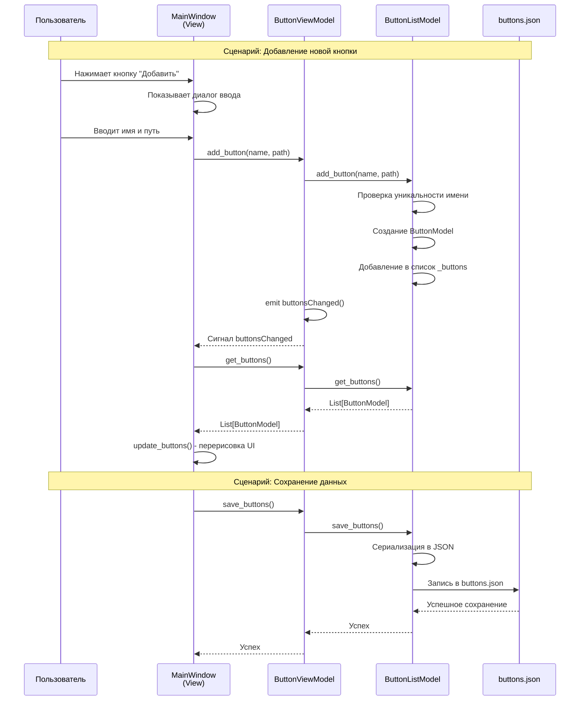

# Характеристика модуля `src/observers/file_watcher.py`

## Общая информация

### Назначение модуля
Модуль реализует класс `FileWatcher` для отслеживания изменений файлов и директорий в файловой системе с использованием Qt (PySide6).

### Архитектура и зависимости
- **Базовый класс**: `QObject` (PySide6.QtCore)
- **Основной компонент**: `QFileSystemWatcher`
- **Дополнительно**: `QTimer` для дебаунсинга
- **Стандартные библиотеки**: `os`, `typing`

---

## Основной функционал

### 1. Отслеживание изменений
- **Файлы**: добавление через `watch_file()`, отслеживание изменений и удалений
- **Директории**: рекурсивное отслеживание через `watch_directory()` с автоматическим добавлением подпапок

### 2. Сигналы Qt (события)
- `file_updated(str)` — файл изменён
- `file_deleted(str)` — файл удалён
- `dir_changed(str)` — изменение в директории
- `debounced_file_updated(str)` — файл изменён (после дебаунсинга)
- `watching_paused(bool)` — статус паузы отслеживания

### 3. Дебаунсинг
- Задержка 300 мс для группировки быстрых изменений
- Использует `QTimer` с `setSingleShot(True)`

### 4. Управление паузой
- `pause(duration)` — временная приостановка (по умолчанию 2000 мс)
- `resume()` — возобновление
- `is_watching_paused()` — проверка статуса
- Полезно для предотвращения циклических обновлений при сохранении

### 5. Управление отслеживанием
- `watch_file(path)` — добавить файл
- `watch_directory(dir_path)` — добавить директорию рекурсивно
- `remove_path(path)` — удалить путь из отслеживания
- `get_watched_files()` — список отслеживаемых файлов
- `clear_watched_files()` — очистить все отслеживаемые файлы

---

## Внутренние механизмы

### Автоматическое пересканирование директорий
- `_rescan_directory()` — проверяет актуальность подпапок при изменениях
- Удаляет несуществующие подпапки из наблюдателя
- Добавляет новые подпапки автоматически

### Обработка событий
- `_handle_file_change()` — обработка изменений файлов
- `_handle_dir_change()` — обработка изменений директорий
- `_on_external_file_update()` — обработка с дебаунсингом

---

## Состояние разработки
- ✅ **Реализовано**: основная функциональность (10.08.2025)
- 🚧 **В разработке**: некоторые методы помечены как TODO
- ⚠️ **Мертвый код**: `stop_watching()` содержит неиспользуемый код (`_observer`)

---

## Использование в проекте
Модуль используется в:
1. `MarkdownEditor` — отслеживание изменений открытых файлов
2. `SidePanel` — отслеживание изменений в дереве файлов
3. `FileOperations` — опциональная поддержка отслеживания

---

## Особенности реализации
- ✅ Рекурсивное отслеживание поддиректорий
- ✅ Дебаунсинг для оптимизации производительности
- ✅ Механизм паузы для предотвращения циклических обновлений
- ✅ Автоматическое управление списком отслеживаемых директорий

---

## Потенциальные улучшения
1. Удалить неиспользуемый код в `stop_watching()`
2. Доработать `remove_path()` для работы с директориями
3. Добавить обработку ошибок при работе с файловой системой
4. Улучшить документацию методов

---

## Итоговая оценка
Модуль реализует базовую функциональность отслеживания файлов с дополнительными возможностями (дебаунсинг, пауза, рекурсивное отслеживание). Код структурирован, но есть незавершенные части и неиспользуемый код, требующие доработки.

---

# Часть 1: Код, требующий доработки

## 1. Метод `remove_path()` (строки 155-161)

**Проблемы:**
- Работает только с файлами: проверяет только `self.watcher.files()`, не учитывает директории из `self.watched_dirs`
- Не удаляет директории из `self.watched_dirs` при удалении
- Не обрабатывает рекурсивное удаление поддиректорий

```python
def remove_path(self, path: str) -> None:
    """Удаляет путь из наблюдателя."""
    # TODO 🚧 В разработке: 10.08.2025 - использовать при удалении файла из дерева файлов
    # Проверяет, находится ли указанный путь среди отслеживаемых наблюдателем файлов/путей
    if path in self.watcher.files():
        # Если путь отслеживается, удаляет его из наблюдателя с помощью removePath
        self.watcher.removePath(path)
```

**Что нужно доработать:**
- Проверять и удалять из `self.watcher.directories()`
- Удалять путь из `self.watched_dirs`, если это директория
- Рекурсивно удалять поддиректории при удалении родительской директории

---

## 2. Метод `get_watched_files()` (строки 163-166)

**Проблемы:**
- Возвращает только файлы, не включает директории
- Не учитывает `self.watched_dirs`

```python
def get_watched_files(self) -> list:
    """Возвращает список отслеживаемых файлов"""
    # TODO 🚧 В разработке: 10.08.2025 - использовать при валдации добавления/удаления, не добавлен ли файл уже в наблюдатель
    return self.watcher.files()
```

**Что нужно доработать:**
- Переименовать в `get_watched_paths()` или добавить `get_watched_directories()`
- Возвращать полный список отслеживаемых путей (файлы + директории)

---

## 3. Метод `stop_watching()` (строки 174-177)

**Проблемы:**
- Обращается к несуществующему атрибуту `_observer` (в классе его нет)
- Не останавливает `QFileSystemWatcher` и таймеры
- Не очищает отслеживаемые пути

```python
def stop_watching(self):
    """Останавливает наблюдение за файлами"""
    if hasattr(self, '_observer') and self._observer.isRunning():
        self._observer.stop()
```

**Что нужно доработать:**
- Удалить проверку `_observer`
- Остановить `self._debounce_timer`
- Очистить все отслеживаемые пути через `self.watcher.removePaths()`
- Очистить `self.watched_dirs`

---

# Часть 2: Неиспользуемый код

## 1. Метод `clear_watched_files()` (строки 168-172)

**Статус:** Не используется в проекте (только определение в файле)

```python
def clear_watched_files(self) -> None:
    """Очищает список отслеживаемых файлов"""
    #  ⌛ Реализовано: 10.08.2025 - мертвый код оставить для будущих задач
    if self.watcher.files():
        self.watcher.removePaths(self.watcher.files())
```

**Проблемы:**
- Не вызывается нигде в проекте
- Очищает только файлы, не директории
- Не очищает `self.watched_dirs`

**Рекомендация:** Удалить или доработать для использования в `stop_watching()`

---

## 2. Фрагмент в `stop_watching()` (строки 176-177)

**Статус:** Неработающий код (ссылается на несуществующий атрибут)

```python
if hasattr(self, '_observer') and self._observer.isRunning():
    self._observer.stop()
```

**Проблемы:**
- Атрибут `_observer` не создается в `__init__`
- Условие всегда `False`
- Код никогда не выполняется

**Рекомендация:** Удалить и заменить на корректную реализацию остановки наблюдения

---

## Итоговая сводка

**Требуют доработки:**
- `remove_path()` — добавить поддержку директорий
- `get_watched_files()` — расширить функциональность
- `stop_watching()` — исправить реализацию

**Не используется:**
- `clear_watched_files()` — мертвый код
- Фрагмент с `_observer` в `stop_watching()` — неработающий код

---

# Схема паттерна Model-View-ViewModel (MVVM)

## Диаграмма структуры паттерна MVVM



## Диаграмма последовательности взаимодействия компонентов



## Легенда схемы

### Цветовое кодирование:
- **Голубой** (#e1f5ff) — View (компоненты представления)
- **Желтый** (#fff4e1) — ViewModel (модель представления)
- **Зеленый** (#e8f5e9) — Model (модель данных)
- **Фиолетовый** (#f3e5f5) — Внешние ресурсы (файлы)
- **Красный** (#ffebee) — Сигналы Qt

### Типы связей:
- **Сплошная стрелка** (→) — прямой вызов метода / команда
- **Пунктирная стрелка** (-.->) — уведомление через сигналы Qt (односторонняя связь)
- **Двойная стрелка** (↔) — двустороннее взаимодействие

### Основные потоки данных:

1. **Команды пользователя**: User → View → ViewModel → Model
2. **Уведомления об изменениях**: Model → ViewModel → (сигнал) → View
3. **Запрос данных**: View → ViewModel → Model → ViewModel → View
4. **Персистентность**: Model ↔ JSON файл

---

# UML диаграмма классов архитектуры MVVM

## Диаграмма классов паттерна MVVM

```mermaid
classDiagram
    %% External Dependencies
    class QMainWindow {
        <<Qt Framework>>
    }
    class QDialog {
        <<Qt Framework>>
    }
    class QObject {
        <<Qt Framework>>
    }
    class Signal {
        <<Qt Framework>>
    }
    
    %% Model Layer
    class IButtonModel {
        <<interface>>
        +get_buttons() List[ButtonModel]*
        +add_button(name: str, path: str)*
        +remove_button(index: int)*
        +save_buttons()*
        +load_buttons()*
    }
    
    class ButtonModel {
        <<dataclass>>
        +name: str
        +path: str
    }
    
    class ButtonListModel {
        -_buttons: List[ButtonModel]
        -_file_path: str
        +__init__(file_path: str, name_file: str)
        +get_buttons() List[ButtonModel]
        +get_button(index: int) ButtonModel
        +add_button(name: str, path: str)
        +remove_button(index: int)
        +edit_button(index: int, name: str, path: str)
        +is_valid_button(name: str, path: str) bool
        +is_button_name_unique(name: str) bool
        +sort_buttons(key: Callable)
        +save_buttons()
        +load_buttons()
    }
    
    %% ViewModel Layer
    class IButtonViewModel {
        <<interface>>
        +get_buttons() List[ButtonModel]*
        +add_button(name: str, path: str)*
        +execute_program(index: int)*
    }
    
    class ButtonViewModel {
        -_model: IButtonModel
        +buttonsChanged: Signal
        +__init__(model: IButtonModel)
        +get_buttons() List[ButtonModel]
        +add_button(name: str, path: str)
        +remove_button(index: int)
        +edit_button(index: int, name: str, path: str)
        +sort_buttons()
        +execute_program(index: int)
        +is_valid_button(name: str, path: str) bool
        +save_buttons()
    }
    
    class DeleteButtonsViewModel {
        -_model: ButtonListModel
        -_selected_buttons: Set[str]
        +buttonsUpdated: Signal
        +selection_changed: Signal
        +__init__(model: ButtonListModel)
        +get_buttons() List[ButtonModel]
        +get_all_buttons() List[str]
        +get_selected_buttons() List[str]
        +get_selected_indices() List[int]
        +toggle_selection(name: str)
        +remove_button(names: List[str])
    }
    
    %% View Layer
    class MainWindow {
        -view_model: IButtonViewModel
        -is_collapsed: bool
        -central_widget: QWidget
        -main_layout: QHBoxLayout
        -buttons_layout: QHBoxLayout
        -add_button: QPushButton
        -delete_button: QPushButton
        -close_button: QPushButton
        +__init__(view_model: IButtonViewModel)
        +add_button_clicked()
        +delete_button_clicked()
        +close_panel()
        +update_buttons()
        +toggle_panel()
        -_init_position_menu()
        -load_icon_from_base64(data: str) QIcon
    }
    
    class DeleteButtonsDialog {
        -view_model: DeleteButtonsViewModel
        -table: QTableWidget
        +__init__(view_model: DeleteButtonsViewModel, parent: QWidget)
        +update_table()
        +get_selected_buttons() List[str]
    }
    
    %% Relationships - Inheritance
    QMainWindow <|-- MainWindow
    QDialog <|-- DeleteButtonsDialog
    QObject <|-- ButtonViewModel
    QObject <|-- DeleteButtonsViewModel
    
    %% Relationships - Interface Implementation
    IButtonModel <|.. ButtonListModel : implements
    IButtonViewModel <|.. ButtonViewModel : implements
    
    %% Relationships - Composition/Aggregation
    ButtonListModel "1" *-- "*" ButtonModel : contains
    MainWindow "1" --> "1" IButtonViewModel : uses
    DeleteButtonsDialog "1" --> "1" DeleteButtonsViewModel : uses
    ButtonViewModel "1" --> "1" IButtonModel : delegates to
    DeleteButtonsViewModel "1" --> "1" ButtonListModel : uses
    
    %% Relationships - Signals
    ButtonViewModel ..> Signal : emits
    DeleteButtonsViewModel ..> Signal : emits
    Signal ..> MainWindow : notifies
    Signal ..> DeleteButtonsDialog : notifies
    
    %% Styling
    classDef modelClass fill:#e8f5e9,stroke:#4caf50,stroke-width:2px
    classDef viewModelClass fill:#fff4e1,stroke:#ff9800,stroke-width:2px
    classDef viewClass fill:#e1f5ff,stroke:#2196f3,stroke-width:2px
    classDef interfaceClass fill:#f3e5f5,stroke:#9c27b0,stroke-width:2px,stroke-dasharray: 5 5
    classDef qtClass fill:#ffebee,stroke:#f44336,stroke-width:1px,stroke-dasharray: 3 3
    classDef dataclassClass fill:#e0f2f1,stroke:#009688,stroke-width:2px
    
    class IButtonModel interfaceClass
    class IButtonViewModel interfaceClass
    class ButtonListModel modelClass
    class ButtonModel dataclassClass
    class ButtonViewModel viewModelClass
    class DeleteButtonsViewModel viewModelClass
    class MainWindow viewClass
    class DeleteButtonsDialog viewClass
    class QMainWindow,QDialog,QObject,Signal qtClass
```

## Описание элементов диаграммы

### Легенда цветов:
- **Зеленый** (#e8f5e9) — Model Layer (модель данных)
- **Желтый** (#fff4e1) — ViewModel Layer (модель представления)
- **Голубой** (#e1f5ff) — View Layer (представление)
- **Фиолетовый** (#f3e5f5, пунктир) — Интерфейсы (абстракции)
- **Красный** (#ffebee, пунктир) — Qt Framework классы
- **Бирюзовый** (#e0f2f1) — Data classes

### Типы связей:

1. **Наследование** (`<|--`):
   - `MainWindow` наследуется от `QMainWindow`
   - `DeleteButtonsDialog` наследуется от `QDialog`
   - `ButtonViewModel` и `DeleteButtonsViewModel` наследуются от `QObject`

2. **Реализация интерфейса** (`<|..`):
   - `ButtonListModel` реализует `IButtonModel`
   - `ButtonViewModel` реализует `IButtonViewModel`

3. **Композиция** (`*--`):
   - `ButtonListModel` содержит множество `ButtonModel` (композиция 1 ко многим)

4. **Ассоциация** (`-->`):
   - `MainWindow` использует `IButtonViewModel` (ассоциация 1 к 1)
   - `DeleteButtonsDialog` использует `DeleteButtonsViewModel` (ассоциация 1 к 1)
   - `ButtonViewModel` делегирует операции `IButtonModel` (ассоциация 1 к 1)
   - `DeleteButtonsViewModel` использует `ButtonListModel` (ассоциация 1 к 1)

5. **Зависимость через сигналы** (`..>`):
   - `ButtonViewModel` испускает сигналы `Signal`
   - `DeleteButtonsViewModel` испускает сигналы `Signal`
   - Сигналы уведомляют `MainWindow` и `DeleteButtonsDialog`

### Ключевые особенности архитектуры:

1. **Разделение ответственности**:
   - **Model** (`ButtonListModel`) — управление данными и бизнес-логикой
   - **ViewModel** (`ButtonViewModel`, `DeleteButtonsViewModel`) — преобразование данных и обработка команд
   - **View** (`MainWindow`, `DeleteButtonsDialog`) — отображение и взаимодействие с пользователем

2. **Слабая связанность**:
   - View зависит только от интерфейсов ViewModel (`IButtonViewModel`)
   - ViewModel зависит только от интерфейсов Model (`IButtonModel`)
   - Связь через сигналы Qt обеспечивает одностороннюю зависимость

3. **Расширяемость**:
   - Интерфейсы позволяют легко заменять реализации
   - Новые View могут использовать существующие ViewModel
   - Новые ViewModel могут работать с существующими Model

4. **Тестируемость**:
   - Каждый слой может быть протестирован независимо
   - Интерфейсы позволяют создавать mock-объекты для тестирования

---

